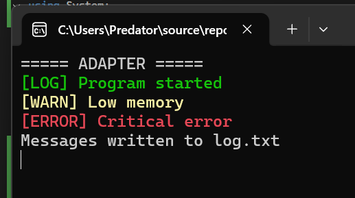
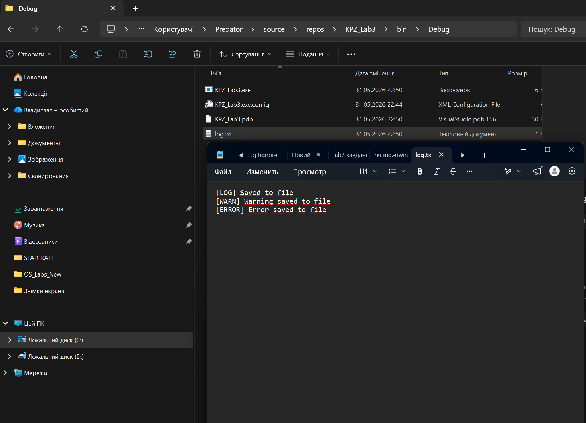

KPZ_Lab3
Лабораторна робота №3

Тема: Структурні шаблони проєктування

Виконав: Політун Владислав

Група: ППЗ-24-3

# Завдання 1. Adapter

Реалізовано шаблон Adapter для адаптації FileWriter до інтерфейсу Logger.

## Результат роботи програми

### Консоль

### Файл log.txt

Завдання 2. Decorator

Реалізовано шаблон Decorator для динамічного розширення характеристик персонажа.

Результат роботи

Завдання 3. Bridge

Реалізовано шаблон Bridge для відокремлення абстракції від реалізації.

Результат роботи

Завдання 4. Proxy

Реалізовано шаблон Proxy для контролю доступу до об'єкта.

Результат роботи

Завдання 5. Composite

Реалізовано шаблон Composite для побудови деревоподібної структури.

Результат роботи

Завдання 6. Flyweight

Реалізовано шаблон Flyweight для спільного використання об'єктів.

Результат роботи

Висновок
Під час виконання лабораторної роботи було вивчено та реалізовано структурні шаблони проєктування: Adapter, Decorator, Bridge, Proxy, Composite та Flyweight. Для кожного шаблону створено окремий приклад використання та продемонстровано його роботу.
