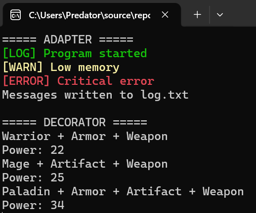
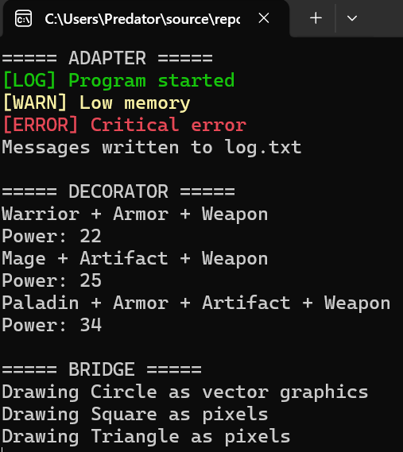
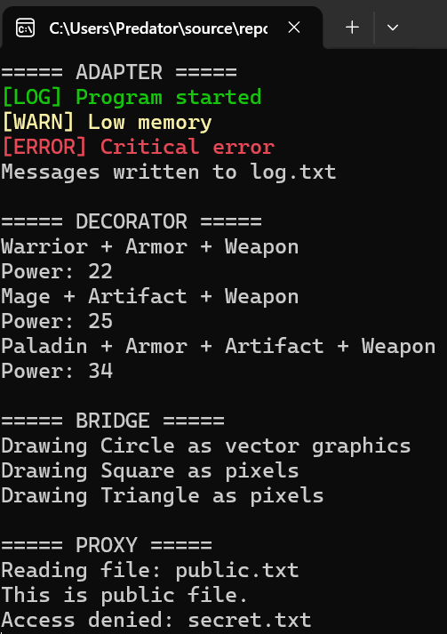
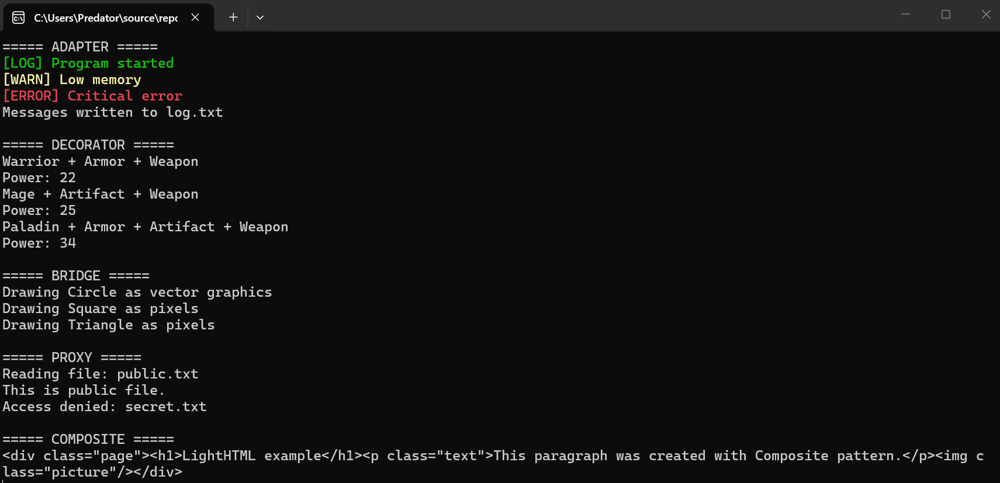
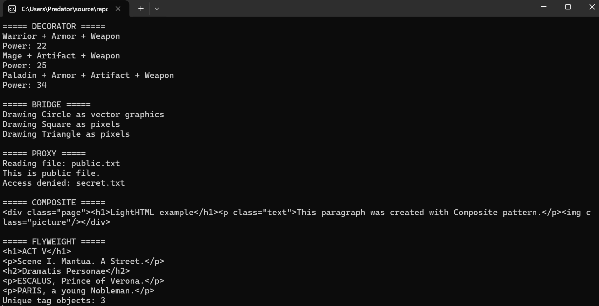

KPZ_Lab3
Лабораторна робота №3

Тема: Структурні шаблони проєктування

Виконав: Політун Владислав

Група: ІПЗ-24-3

# Завдання 1. Adapter

Реалізовано шаблон Adapter для адаптації FileWriter до інтерфейсу Logger.

## Результат роботи програми

### Консоль

### Файл log.txt

# Завдання 2. Decorator

Реалізовано шаблон Decorator для RPG-гри.  
Створено героїв Warrior, Mage, Paladin та інвентар у вигляді декораторів: Armor, Weapon, Artifact.

## Результат роботи

# Завдання 3. Bridge

Реалізовано шаблон Bridge для графічного редактора.

Створено фігури:
- Circle
- Square
- Triangle

Створено способи рендерингу:
- VectorRenderer
- RasterRenderer

## Результат роботи

## Завдання 4. Proxy

Реалізовано шаблон Proxy для контролю доступу до текстових файлів.

### Результат роботи

## Завдання 5. Composite

Реалізовано власну HTML-модель LightHTML за допомогою шаблону Composite.

### Результат роботи

## Завдання 6. Flyweight

Реалізовано шаблон Flyweight для повторного використання об'єктів HTML-тегів.

### Результат роботи

Висновок
Під час виконання лабораторної роботи було вивчено та реалізовано структурні шаблони проєктування: Adapter, Decorator, Bridge, Proxy, Composite та Flyweight. Для кожного шаблону створено окремий приклад використання та продемонстровано його роботу.
